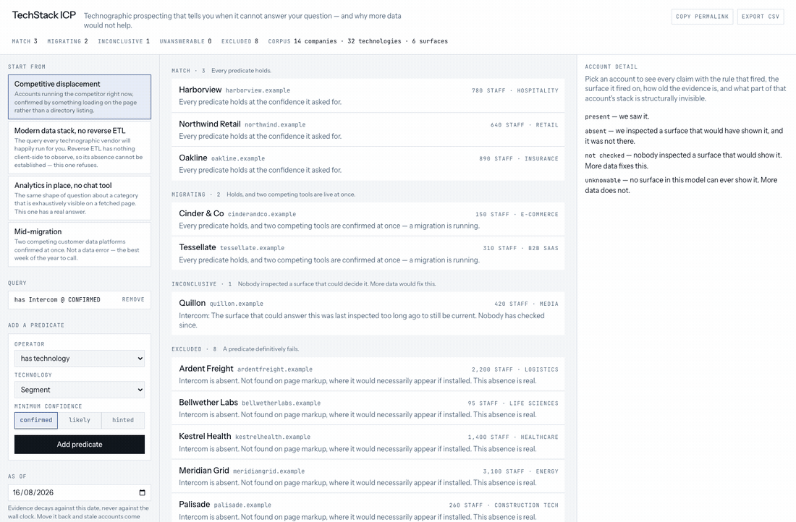
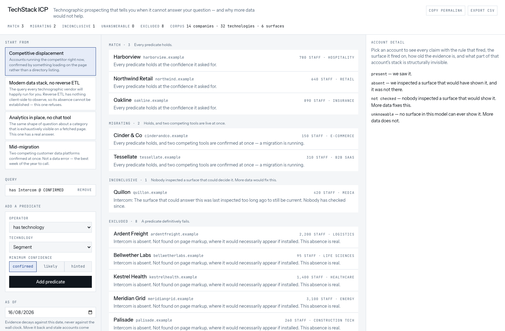
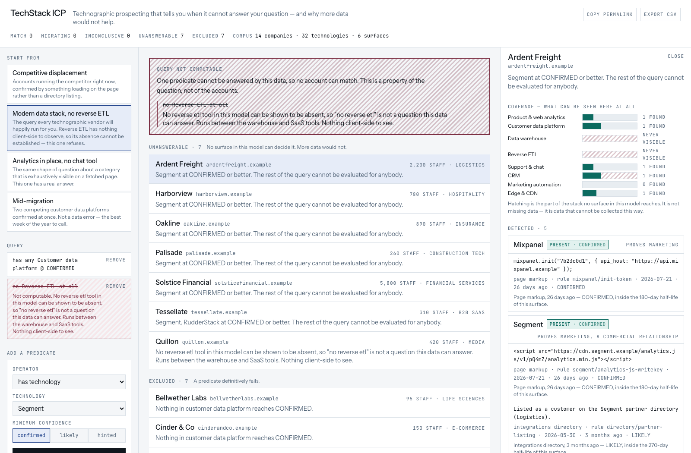
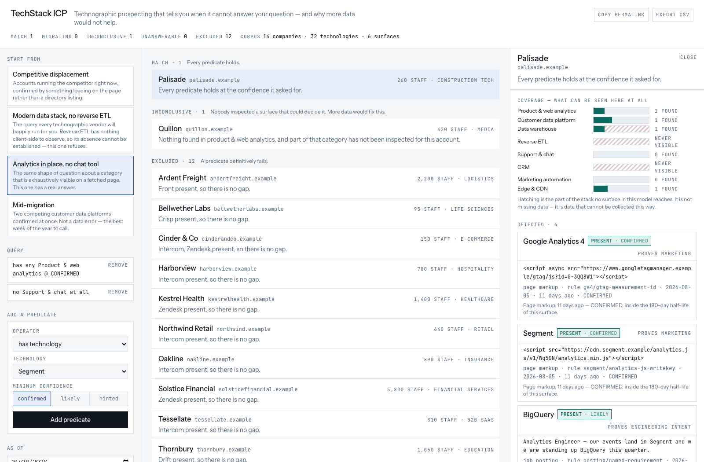

# TechStack ICP

Rank accounts by the technologies they appear to use — and refuse the questions this kind of data cannot answer, instead of answering them wrong.

**[Live demo](https://techstack-icp.vercel.app)** · [Plain-English guide](docs/plain-english-guide.md) · Day 008 of a 100-day building challenge



Opens with 14 companies already resolved. No sign-up, no key, no upload.

## Why I Built This

Technographic data is sold as fact and consumed as fact. A vendor row says

```json
{ "company": "northwind.example", "technologies": ["Segment", "Snowflake", "Intercom"] }
```

and every downstream system — the ICP filter, the territory carve, the "they use our competitor" campaign — treats those three strings as equally true, equally current, and equally meaningful. None of that survives contact with how the data was produced.

**A detection is an observation, not a fact.** Somebody saw something: a script tag, a `Server:` header, an SPF include, a sentence in a job posting, a logo in a directory. A tag that is loading right now is the strongest evidence you can have. A posting asking for three years of Databricks is evidence that somebody *wants* Databricks — a different sentence in a different tense. The array flattens both to a string, and the string is what the rep reads.

**A detection has a reach, and it is usually not the one assumed.** A CDP tag in the marketing site's markup proves the marketing team bought a CDP. An ICP built on "companies with modern data infrastructure" that fires on marketing-site tags is measuring marketing budget.

**Absence of evidence gets sold as evidence of absence.** The highest-value technographic queries are negative — *does not use our competitor*, *has a CDP but no reverse ETL*. Whether "not detected" means "does not use" depends entirely on whether the technology would necessarily have appeared on a surface you actually inspected. An Intercom widget would have. Snowflake never will. Same query shape, one sound and one meaningless, and no tool in the category tells you which one you just ran.

## What It Does

**Every claim carries four things: a state, a grade, its evidence, and its reach.**

| state | meaning | fixable with more data? |
|---|---|---|
| `PRESENT` | we saw it, at `CONFIRMED` / `LIKELY` / `HINTED` | — |
| `ABSENT` | we inspected a surface that would have shown it, and it was not there | — |
| `UNKNOWN` | nobody inspected a surface that would show it | yes |
| `UNKNOWABLE` | no surface in this model can ever show it | **no** |

`UNKNOWN` and `UNKNOWABLE` are the two every vendor collapses into a blank cell, and they are opposite kinds of problem.

**Negative queries are checked for computability before they run.** `not(Intercom)` is answerable — chat widgets are exhaustively visible on a fetched page. `not(Snowflake)` is not answerable at any price, so the predicate is struck through in the builder and the fleet returns a refusal instead of the whole database minus a rounding error. Two presets ship as a matched pair to make the point: *Modern data stack, no reverse ETL* refuses, and *Analytics in place, no chat tool* — the same question shape over a visible category — answers.

**Confidence decays, and the as-of date is a control.** Each surface has a half-life: a page tag 180 days, a response header 90, a job posting 120, an engineering blog 540. One grade demotion per elapsed half-life, then the observation expires. Inspections decay too, so a page fetched in 2023 stops establishing what is on the page today. Move the as-of date back and a stale account becomes a perfect match.

**Relations annotate, they never promote.** Two confirmed competitors is `MIGRATING` — the most actionable state in the product. A retired tag loading beside its replacement is `VESTIGIAL`. A confirmed CDP implies a warehouse exists, and every warehouse stays `UNKNOWABLE` with the implication shown next to it rather than filled in.

**No score.** Accounts group into five tiers — `MATCH`, `MIGRATING`, `INCONCLUSIVE`, `UNANSWERABLE`, `EXCLUDED` — in that precedence. A definitive no beats an unanswerable question, which beats a merely uninspected one. Nothing is summed, so nothing can outweigh an exclusion.

Two optional inputs sit behind collapsed panels:

- **Describe the segment in plain English.** With a Gemini key configured, prose becomes predicates that land *in the builder* for you to check. **The model never detects a technology and never assigns confidence.** Without a key the panel collapses to a line pointing at the builder; everything else works.
- **Inspect a live URL.** One page, robots-honouring, six-second timeout, nothing stored. It populates exactly two surfaces of six, and says so — which is the thesis demonstrating itself on data you chose.

## Demo

The fleet, grouped into tiers, with no score anywhere:



The same question shape, refused. Reverse ETL runs between a warehouse and SaaS tools, so nothing client-side can establish its absence — the predicate is struck through in the builder and the banner says what would be needed:



And the counterpart that answers. Chat widgets are exhaustively visible on a fetched page, so `no chat tool` is a real question with a real answer:



## How It Works

```
observation ──► evidence ──► claim ──► predicate ──► tier
   raw thing     graded by     one of      computable    one of
   that was      kind and      four        or refused    five
   seen          age           states
```

1. **Observation.** A record of something seen on one of six surfaces, with the date and the rule that fired.
2. **Evidence.** The observation graded. A lookup on the *kind* of thing seen sets the base grade — `runtime_artifact` and `configuration_record` are `CONFIRMED`, `commercial_listing` and `stated_requirement` are `LIKELY`, `stated_mention` is `HINTED`, and `negative_statement` never supports anything. Then one demotion per elapsed half-life of that surface.
3. **Claim.** Surviving evidence makes it `PRESENT`. Otherwise a current inspection of a surface that would necessarily have shown it makes it `ABSENT`. Otherwise `UNKNOWN`, or `UNKNOWABLE` if absence can be established nowhere.
4. **Predicate.** `has`, `has_any_in`, `count_in`, `not`, `gap` — the positive ones carrying a minimum confidence, so `has(Segment) @ CONFIRMED` and `has(Segment) @ HINTED` are different questions.
5. **Tier.** One of five, first match wins.

The six surfaces, and what each actually proves:

| surface | proves | half-life | can absence be established? |
|---|---|---|---|
| Page markup | the marketing site loads this | 180d | yes |
| HTTP headers | this sits in front of the site | 90d | yes |
| DNS records | the domain routes through this | 365d | yes |
| Job posting | somebody wants this skill | 120d | no |
| Engineering blog | engineering wrote about this | 540d | no |
| Integrations directory | a commercial relationship exists | 270d | no |

## Architecture

```
                    ┌─ server component ─► data/*.ts (Zod-validated at import)
Browser ────────────┤
                    ├─ lib/technographics (pure, zero deps) ─► runs on both sides
                    │
                    ├─ POST /api/translate  ─► key check ─► rate limit ─► model ─► Zod
                    └─ POST /api/inspect    ─► robots ─► fetch ─► detect
```

`lib/technographics/` is the engine and is **dependency-free and framework-free** — it imports `zod` and nothing else. `purity.test.ts` enforces that by scanning the source with no allowlist, and the point is not tidiness: a module that cannot import a model client cannot invent a detection, so every claim on screen came from an observation passed in as an argument. It has [its own README](lib/technographics/README.md).

The engine ships to the browser. Moving the as-of date re-resolves 14 companies × 32 technologies with no round trip.

## Key Decisions & Tradeoffs

- **Decision:** No score, no weights, five tiers.
  **Why:** A number lets two strong matches outweigh a definitive exclusion, which is how a 200,000-employee enterprise ends up in an SMB list.
  **Tradeoff:** You cannot sort a tier by "best". Within a tier, ordering is by weakest satisfied claim, then by name.

- **Decision:** Four states, not three.
  **Why:** "Nobody looked" is fixable with more data. "Nothing can look" is not. Merging them is the single most expensive simplification in this category.
  **Tradeoff:** More states to explain, and a UI that has to teach a distinction before it is useful.

- **Decision:** `implies` annotates, never promotes.
  **Why:** Inferring "they have a warehouse" is sound; inferring *which* warehouse is the vendor behaviour this repo refuses.
  **Tradeoff:** The most commercially useful field stays empty, on purpose.

- **Decision:** Grades are ordinal, from a lookup table.
  **Why:** `0.7 × 0.8 = 0.56` means nothing and cannot be argued with.
  **Tradeoff:** No fine-grained ranking between two `CONFIRMED` claims.

- **Decision:** Live inspection populates two surfaces, never more.
  **Why:** One fetch genuinely cannot see DNS, postings, blogs or directories. Reporting those as absent would be the exact failure the repo is about.
  **Tradeoff:** The live path detects far less than the bundled corpus, which is the honest amount.

- **Decision:** The corpus is authored and synthetic.
  **Why:** Real technographic data cannot be redistributed, and hand-built fixtures can carry a named trap each.
  **Tradeoff:** Nothing here is a claim about a real company. Every domain ends in `.example`.

## Getting Started

```bash
git clone https://github.com/akshatiwarix/techstack-icp.git
cd techstack-icp
npm install
npm run dev
```

Optional — the prose-to-query panel only:

```bash
cp .env.example .env.local
# add GEMINI_API_KEY=...
```

Everything except that one panel works with no key.

```bash
npm run build       # production build
npm test            # 91 unit tests
npm run sweep       # 25,032 invariant assertions, no network
npm run typecheck   # next typegen && tsc --noEmit
npm run lint        # eslint, including the engine boundary rule
```

Run a single trap by name: `npx vitest run -t "vestigial"`.

## Tests

91 unit tests, plus `npm run sweep` — 14 companies × 32 technologies × 5 as-of dates and every predicate shape against every account, 25,032 assertions, no network and no randomness. It asserts what the unit tests cannot see: exactly one state per pair, `PRESENT` implies surviving evidence, `ABSENT` implies a current inspection of a surface that could show it, `UNKNOWABLE` implies absence is establishable nowhere, `implies` never promotes, confidence never improves as time advances, and an uncomputable predicate never produces a match.

Each of the fourteen corpus traps has a test named after it: `vestigial`, `mid_migration`, `aspirational_posting`, `marketing_only_reach`, `implied_but_dark`, `one_surface_only`, `uncomputable_negation`, `displacement_target`, `stale`, `dns_only`, `answerable_gap`, `contradiction`, `excluded`, `supersession_chain`.

## The corpus is authored

Fourteen companies, 32 technologies, 89 observations, all invented. Every domain ends in `.example` and no real company is described. The accounts exist to carry fourteen specific traps — a retired tag still loading, two competing CDPs at once, a posting for a warehouse nobody deployed, a detection that only proves marketing, an implied warehouse nothing can see, and one account where the correct answer is that nobody has checked.

To watch the same engine run on real data, inspect a live URL — and note how little of a stack one fetch can see.

## What is not here

- No demo of the prose-to-query panel in the screenshots: it needs a key, and the deployment runs without one.
- The live inspection path detects 22 technologies, not all 32. The rest have nothing client-side to match on, which is the point rather than a gap.
- No persistence, accounts, or CRM export beyond CSV.

## Sibling repos

Day 001 [`icp-score`](https://github.com/akshatiwarix/icp-score) owns weighted scoring with visible arithmetic. Day 005 [`signal-scout`](https://github.com/akshatiwarix/signal-scout) owns deriving events from dated observations. Day 006 [`account-brief`](https://github.com/akshatiwarix/account-brief) owns character-span provenance. Day 007 [`why-now`](https://github.com/akshatiwarix/why-now) asks whether an inference follows. This one asks whether we know the thing at all.

## License

MIT
